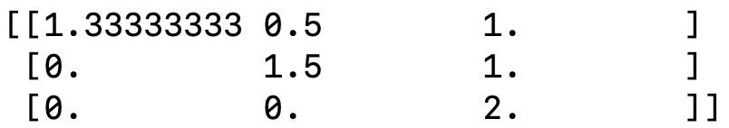

# Modeling random never increasing function

## Intro
There is a counter that chooses a random number between 1 and 1000, and then chooses another random number between 1 and the previously chosen number and continues
this trend. How long until the counter reaches 0? What if we change the initial value  to be 500 or 20000? Can we find a general solution for any upper bound and
model the relationship between the current upper boundand the average number of steps to reach 1? Here I show how this problem can be solved using an absorbing 
markov model and implement my solution in python.

## The problem
An arbitrary upper bound  is chosen. An integer,, 
is generated from a discrete uniform distribution  A number is then is then generated from
. This value will be used as the next upper bound...
This is repeated until the integer 1 is generated. What is the average number of steps to generate 1. It is important to take into account that the distribution
 is inclusive, so can return 
.

So we want to find the average number of steps from an upperbound  to 1, 
when .

## The model
To solve this problem we can use a markov model with an absorbing state. For an upper bound  our transition
matrix P will be a  by  with states  to 1. 
1 will be the only absorbing state in the matrix. The matrix will be triangular because the probability of transition to a higher state is 0 (Our counter is 
counting down). Thus 1 is an absorbing state as it can only transition to itself. We can call this matrix the canonical matrix and seperate it into four components.

)

Where  is the transition matrix between transient states (Transient means not absorbing!). Each value in
 is the chance of transitioning from one transient state to another. We can use this matrix to find %5E%7B-1%7D)
wich is more useful to our problem. Each row tells us the expected number of times that node will visit each other node. So if we sum that collumn we get the 
expected number of steps until we reach 1! Why does this work? Because we adding the expecter number of times we visit non absorbing nodes (including the current node) 
before reaching an absorbing node. Since our only absorbing node is 1, this tells us the expected number of steps before reaching 1.

## The code
The code is a simple function that takes an upper bound as a parameter and returns the expected number of steps before reaching 1.

Below is an example using the function to return the expected number of steps from 1000 to reach 1.

## Simple example
In this section I show a simple example for an initial upper bound of 4. Below is the transition matrix. The rows and collumns count down from the upper bound. So
our first row represents transitions from 4, the second transitions from 3 e.c.t. You can see that our initial state has a 1/4 chance of transition to each state, 
including itself. You can also ssee how each state can't go to a higher state creating a tringulr matrix. Finally note how there is a single absorbing state.

Our second matrix Q is the probability of transitioning between transient states. It should be clear how these values have been taken from the above transition matrix.

Below is the the matrix %5E%7B-1%7D).The first row of this  collumn is whag is useful to us. Each
element in the first row represents the expected number of visits to each transient node from the upper bound. If we sum this row we get the expected number of 
visits to transient nodes before reaching an absorbing node. This gives us the expected number of visits to transient nodes before reaching an absorbing node. This 
is equivalent to the number of steps before reaching 1.

Our final answer given by summing the top row is 2.833 .
## Sources
[Allan Yashinski, 2021] https://www.math.umd.edu/~immortal/MATH401/book/ch_absorbing_markov_chains.pdf

